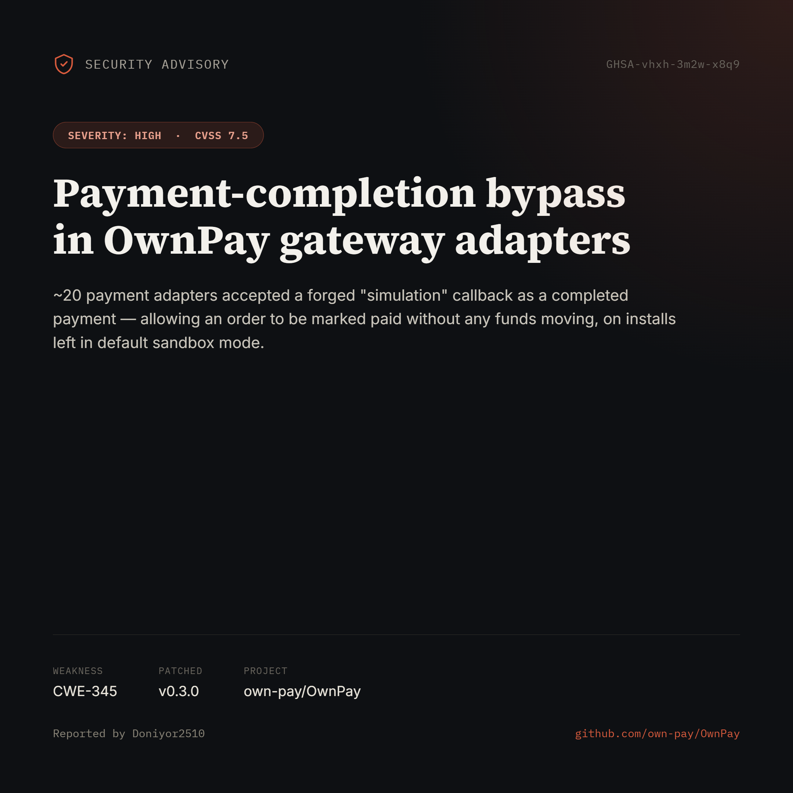

# OwnPay — Payment-Completion Bypass via Forged "Simulation" Callback



**Advisory:** [GHSA-vhxh-3m2w-x8q9](https://github.com/own-pay/OwnPay/security/advisories/GHSA-vhxh-3m2w-x8q9)
**Severity:** High — CVSS 3.1: 7.5 (`AV:N/AC:L/PR:N/UI:N/S:U/C:N/I:H/A:N`)
**Weakness:** CWE-345 (Insufficient Verification of Data Authenticity) / CWE-287 (Improper Authentication)
**Affected:** `own-pay/ownpay` ≤ 0.2.0
**Patched:** 0.3.0

## Summary

~20 payment-gateway adapters in OwnPay (Xendit, PayPal, Google Pay, Authorize.net, and others) accepted an unauthenticated, attacker-controlled "simulation" callback as a completed payment. The vulnerable code path gated the simulation-accept branch only on the merchant-controlled `mode` credential (`live`/`sandbox`), while omitting the project's own production backstop, `GatewayDefaults::isProductionEnv()`.

On any production install where a gateway was left in its default sandbox mode, a remote attacker holding a valid checkout token could forge a `SIM_` callback and mark an order as paid — for any amount, with no funds actually moving.

## Reachability

```
GET /checkout/{token}/status  (unauthenticated, buyer holds a valid token)
  → CheckoutController::status
  → GatewayApiService::handleCallback(webhookVerified=false)
  → Adapter::verify()  ← missing isProductionEnv() guard
```

## Proof of Concept

A harness run against the real adapter code, same environment (`APP_ENV=production`), same forged input, compared a vulnerable adapter against a correctly-guarded one:

```
Attacker callback: {"gateway_trx_id":"SIM_1337","amount":"999999.00","status":"PAID"}
Merchant creds:    {"mode":"sandbox"}
================================================================
XenditGateway      => success=TRUE  status=completed  amount=999999.00   <-- PAYMENT ACCEPTED
TwoCheckoutGateway => success=false (rejected)                            <-- backstop blocks it
```

## Remediation

Add the production backstop to the simulation-accept branch of every affected adapter:

```php
if ($this->isProductionEnv()) {
    return ['success' => false, 'gateway_trx_id' => '', 'status' => 'failed'];
}
```

Fixed upstream in [v0.3.0](https://github.com/own-pay/OwnPay/security/advisories/GHSA-vhxh-3m2w-x8q9).

---

*Full write-up and credits: see the [GitHub Security Advisory](https://github.com/own-pay/OwnPay/security/advisories/GHSA-vhxh-3m2w-x8q9).*
