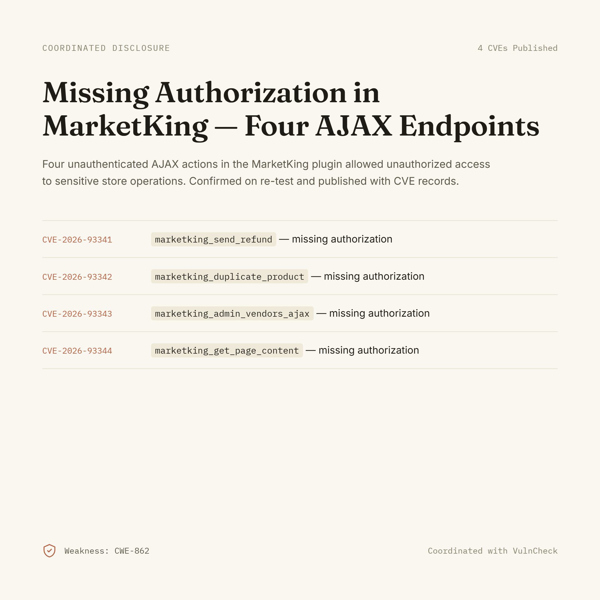

# MarketKing — Missing Authorization via Multiple AJAX Endpoints

**CVEs:** [CVE-2026-93341](https://nvd.nist.gov/vuln/detail/CVE-2026-93341) · [CVE-2026-93342](https://nvd.nist.gov/vuln/detail/CVE-2026-93342) · [CVE-2026-93343](https://nvd.nist.gov/vuln/detail/CVE-2026-93343) · [CVE-2026-93344](https://nvd.nist.gov/vuln/detail/CVE-2026-93344)
**Weakness:** CWE-862 (Missing Authorization)
**Coordinated with:** VulnCheck
**Status:** Published, confirmed on re-test

## Summary

Four AJAX actions exposed by the MarketKing WooCommerce multi-vendor plugin were reachable without any authorization check, allowing unauthenticated or under-privileged requests to trigger sensitive store operations.

| CVE | Endpoint | Issue |
|---|---|---|
| CVE-2026-93341 | `marketking_send_refund` | Missing authorization |
| CVE-2026-93342 | `marketking_duplicate_product` | Missing authorization |
| CVE-2026-93343 | `marketking_admin_vendors_ajax` | Missing authorization |
| CVE-2026-93344 | `marketking_get_page_content` | Missing authorization |

## Impact

Each endpoint performs a privileged store action (issuing refunds, duplicating products, managing vendors, or reading admin page content) without verifying that the requester holds the required capability or nonce. An attacker able to reach these AJAX actions could trigger them directly.

## Disclosure Timeline

- Vulnerabilities identified and reported through coordinated disclosure.
- Re-test conducted to confirm the fixes / reproducibility.
- CVE records published by VulnCheck.

## Remediation

Each AJAX handler should verify the requesting user's capability (e.g. `current_user_can()`) and a valid nonce before executing the action, consistent with WordPress AJAX security guidelines.

---

*Credits and coordination: VulnCheck Disclosure Team.*
